# PCB/Hardware as Code - System Architecture

## Overview

PCB/Hardware as Code is a modern approach to electronic design automation (EDA) that allows engineers and developers to describe hardware designs using code rather than traditional CAD tools. This document outlines the architecture of a system that enables this paradigm shift.

## System Architecture Overview

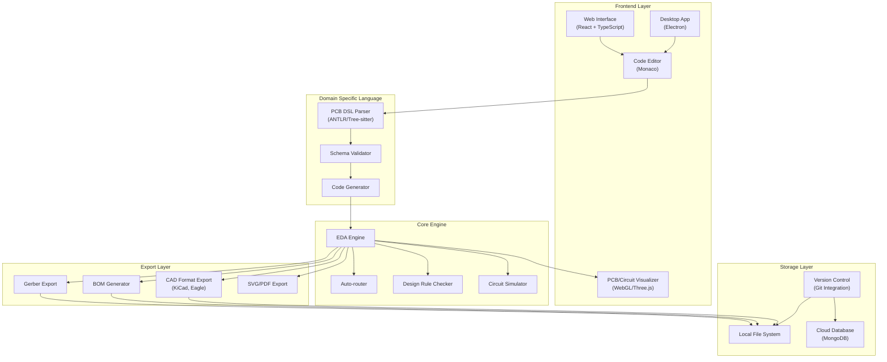

## PCB Compilation Pipeline

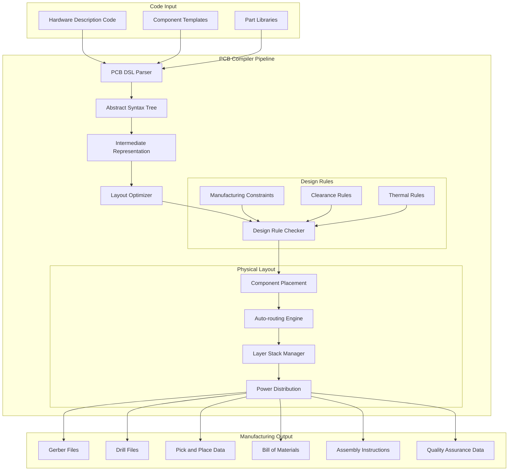

## Design Workflow

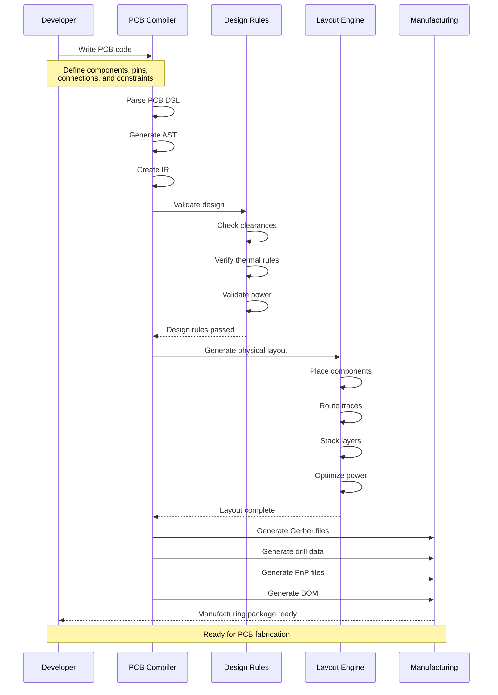

## Component Details

### 1. Frontend Layer

The frontend layer provides multiple interfaces for users to interact with the system:

#### Web Interface
- **Technology Stack**: React + TypeScript
- **Features**:
  - Real-time collaborative editing
  - Cloud-based project management
  - Component library browser
  - Interactive PCB preview
- **Architecture**:
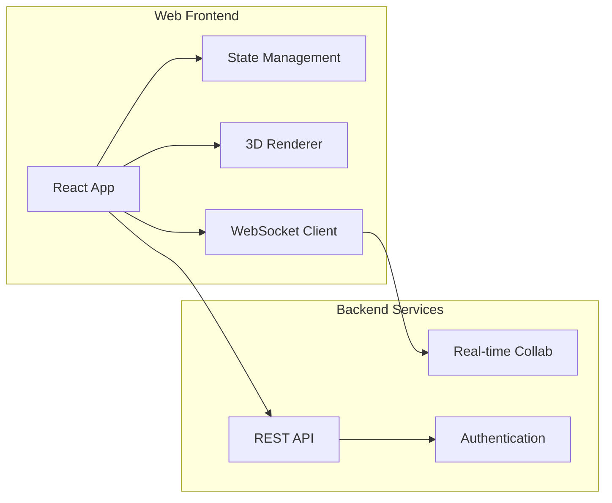

#### Desktop Application
- **Technology**: Electron
- **Features**:
  - Native file system access
  - Local component library
  - Offline-first operation
  - System integration
- **Architecture**:
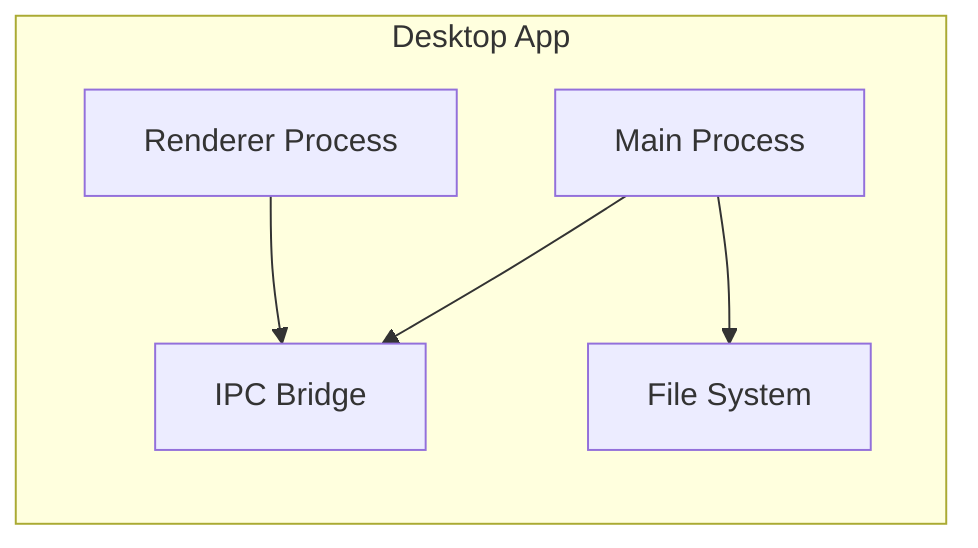

### 2. Domain Specific Language (DSL)

The DSL layer handles the translation of user code into PCB designs:

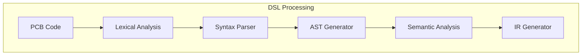

#### Example PCB Code:
```python
# Component definition
component ATmega328P:
    pins:
        VCC: power_in(3.3V, 5V)
        GND: ground
        D0..D7: digital_io
        A0..A5: analog_in
        
    footprint: TQFP-32
    
# Board definition
board MyProject:
    layer_stack:
        top_copper
        inner_1: ground
        inner_2: power
        bottom_copper
        
    components:
        mcu: ATmega328P
        crystal: Crystal(16MHz)
        
    connections:
        mcu.VCC -> power.5V
        mcu.D0 -> uart.TX
        mcu.D1 -> uart.RX
```

### 3. Core Engine

The core engine processes the IR into physical board designs:

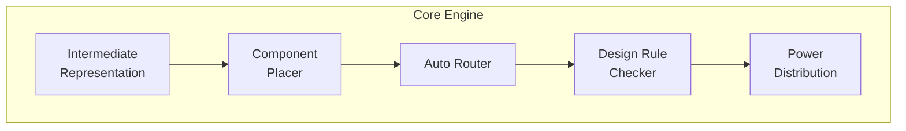

#### Component Placement
- Force-directed placement algorithm
- Thermal considerations
- Signal path optimization
- Component grouping

#### Auto-routing
- Lee algorithm for maze routing
- Length matching for differential pairs
- Via minimization
- Layer assignment optimization

### 4. Manufacturing Output

The manufacturing output system generates production-ready files:

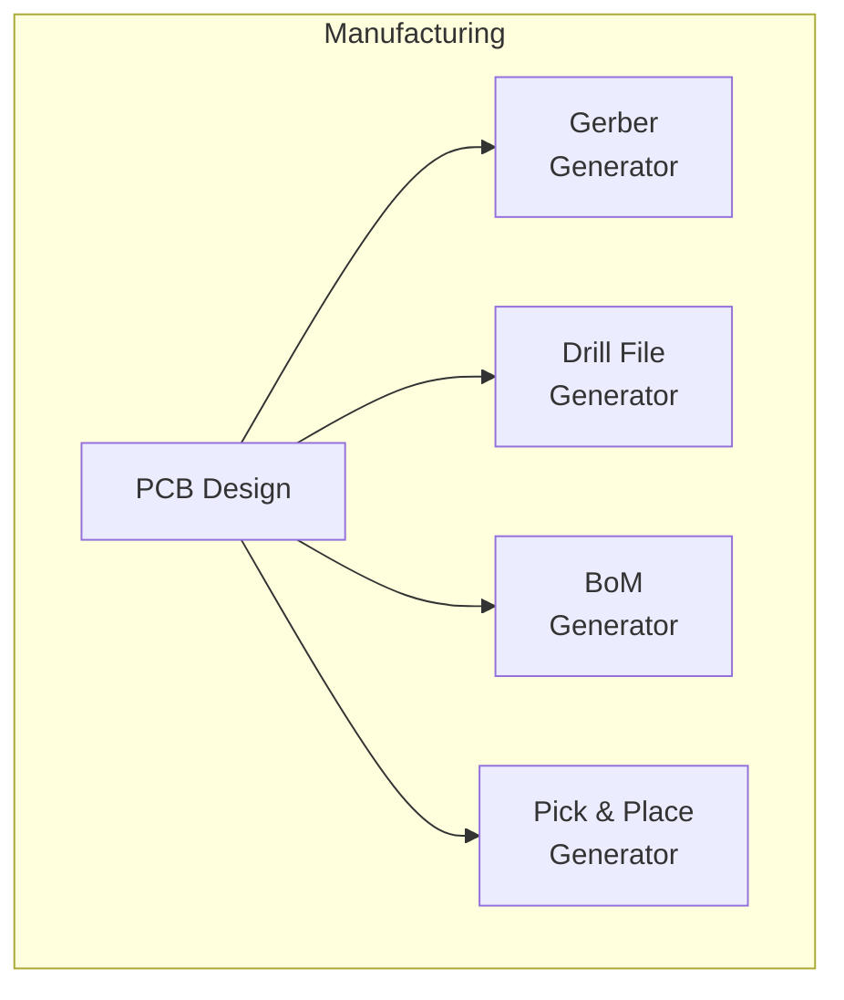

#### Gerber Generation
- RS-274X format
- Layer-specific files
- Aperture definitions
- Metadata inclusion

### 5. Quality Assurance

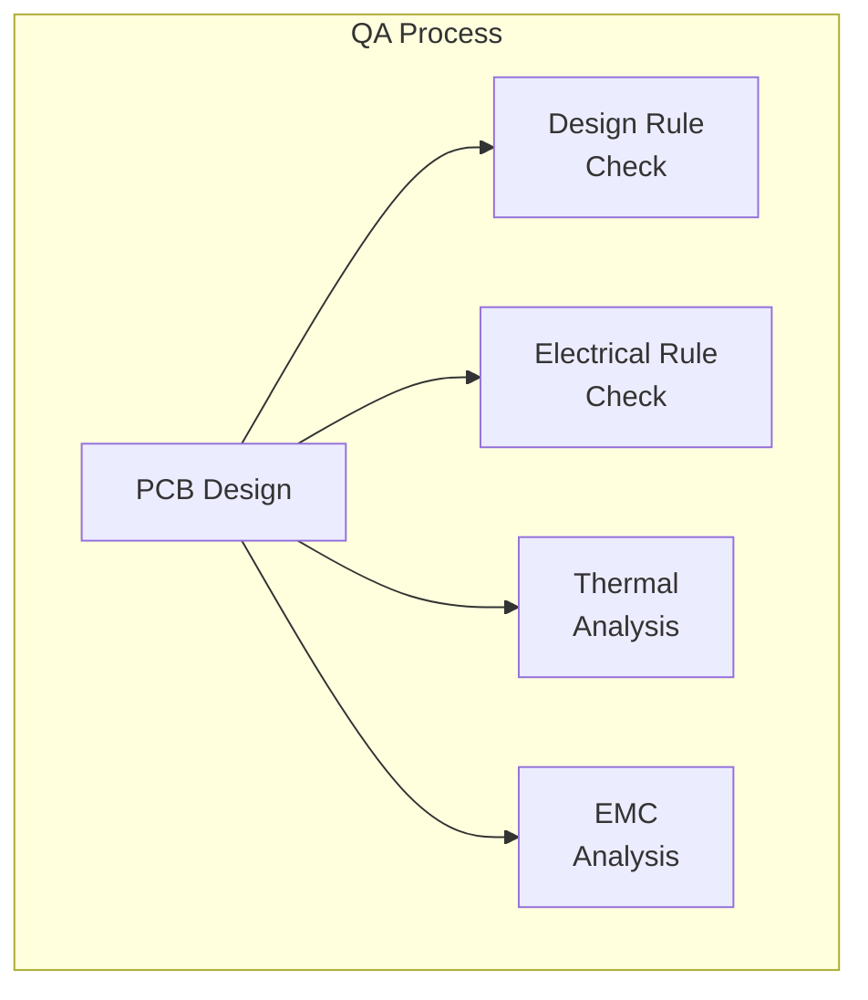

## Data Flow

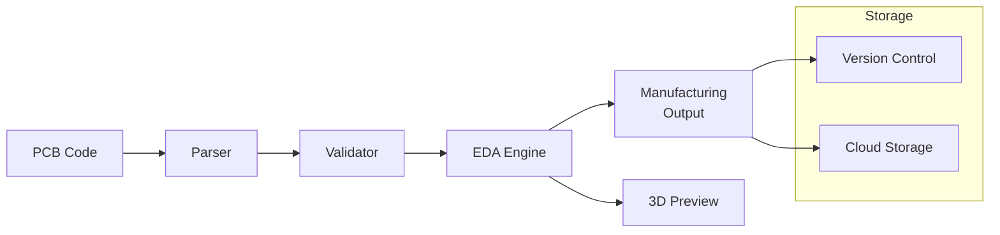

## Security Model

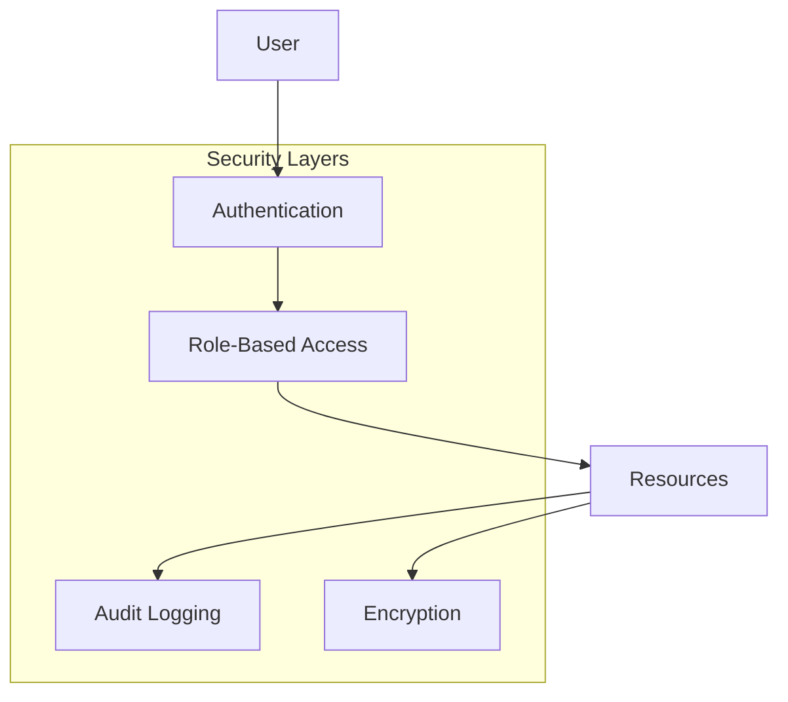

## Deployment Architecture

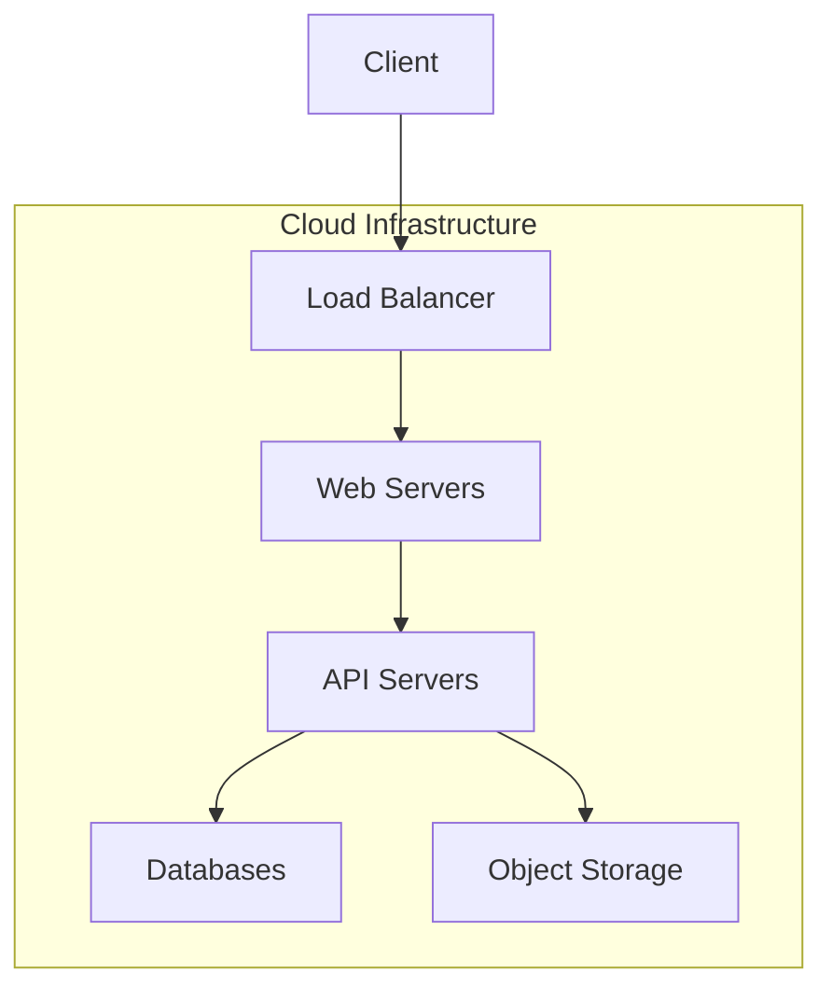

This expanded architecture provides a comprehensive view of the system's capabilities and interactions. Each component is designed to be modular and scalable, allowing for future enhancements and optimizations.
