# PCB/Hardware as Code - System Architecture

## Overview

PCB/Hardware as Code is a modern approach to electronic design automation (EDA) that allows engineers and developers to describe hardware designs using code rather than traditional CAD tools. This document outlines the architecture of a system that enables this paradigm shift.

## System Architecture Overview

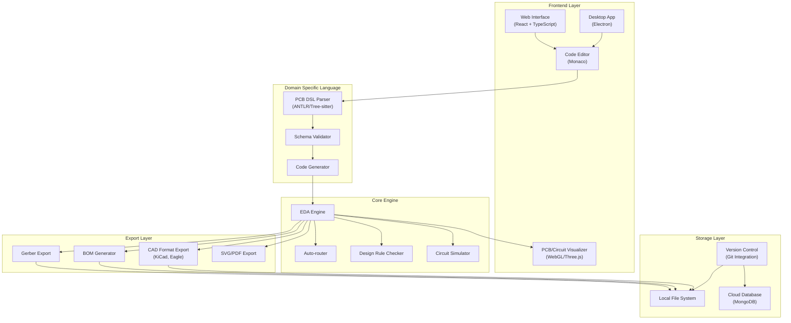

## PCB Compilation Pipeline

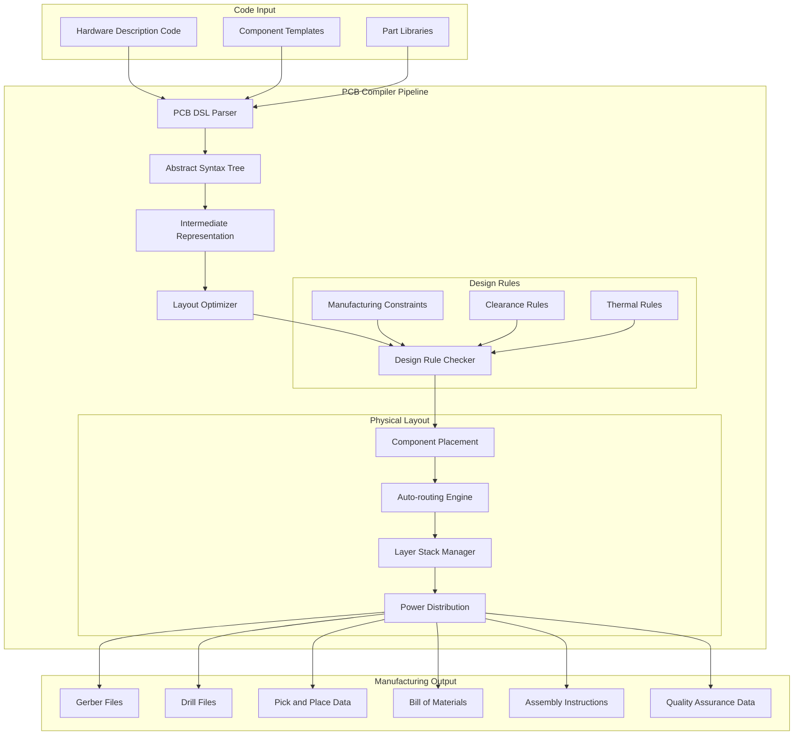

## Design Workflow

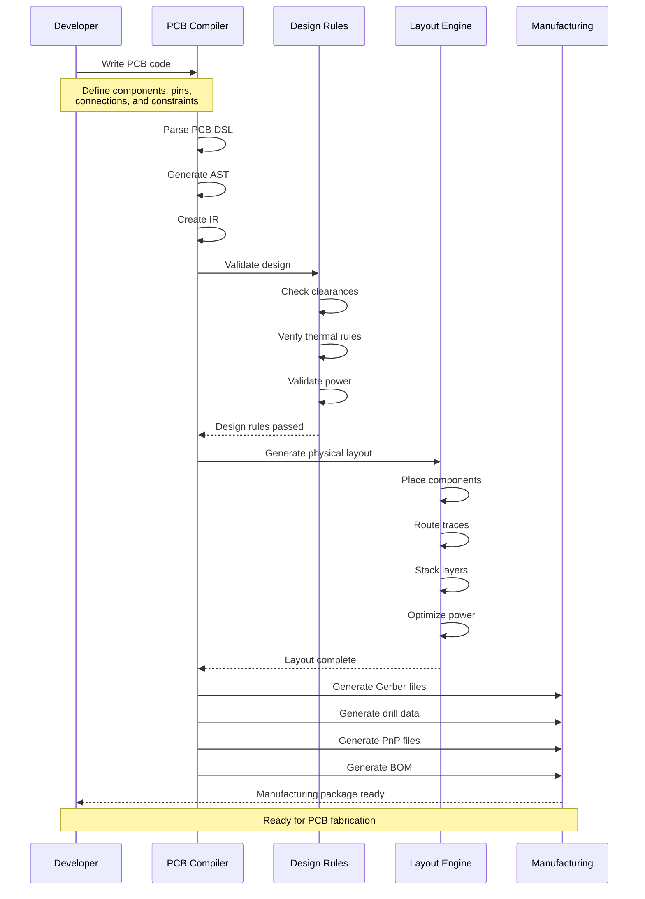

## Component Details

### 1. Frontend Layer

The frontend layer provides multiple interfaces for users to interact with the system:

#### Web Interface
- **Technology Stack**: React + TypeScript
- **Features**:
  - Real-time collaborative editing
  - Cloud-based project management
  - Component library browser
  - Interactive PCB preview
- **Architecture**:
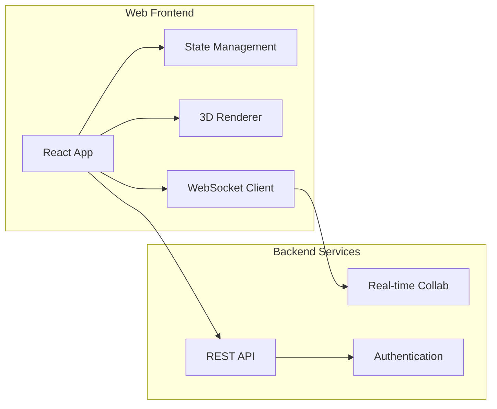

#### Desktop Application
- **Technology**: Electron
- **Features**:
  - Native file system access
  - Local component library
  - Offline-first operation
  - System integration
- **Architecture**:
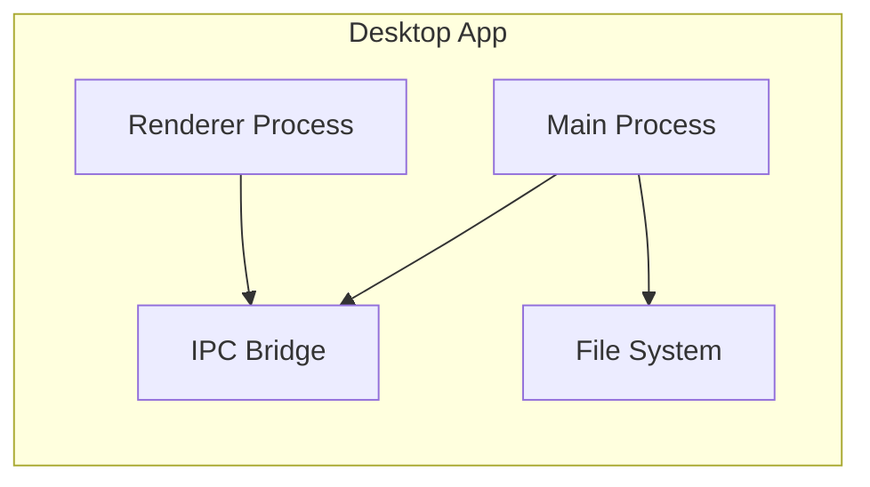

### 2. Domain Specific Language (DSL)

The DSL layer handles the translation of user code into PCB designs:

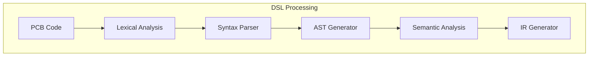

#### Example PCB Code:
```python
# Component definition
component ATmega328P:
    pins:
        VCC: power_in(3.3V, 5V)
        GND: ground
        D0..D7: digital_io
        A0..A5: analog_in
        
    footprint: TQFP-32
    
# Board definition
board MyProject:
    layer_stack:
        top_copper
        inner_1: ground
        inner_2: power
        bottom_copper
        
    components:
        mcu: ATmega328P
        crystal: Crystal(16MHz)
        
    connections:
        mcu.VCC -> power.5V
        mcu.D0 -> uart.TX
        mcu.D1 -> uart.RX
```

### 3. Core Engine

The core engine processes the IR into physical board designs:

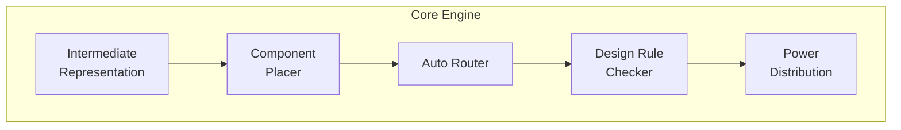

#### Component Placement
- Force-directed placement algorithm
- Thermal considerations
- Signal path optimization
- Component grouping

#### Auto-routing
- Lee algorithm for maze routing
- Length matching for differential pairs
- Via minimization
- Layer assignment optimization

### 4. Manufacturing Output

The manufacturing output system generates production-ready files:

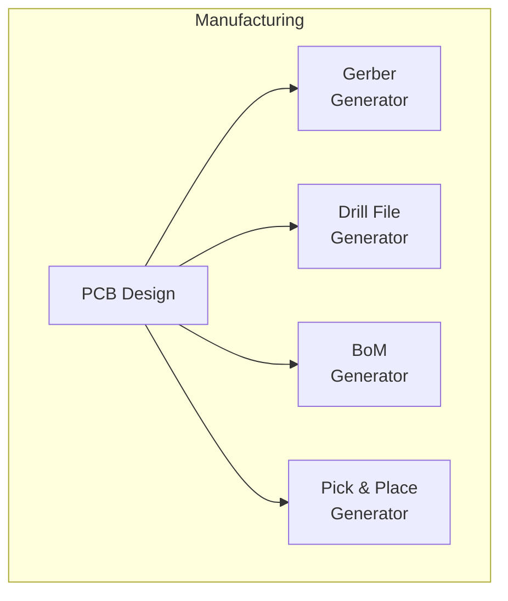

#### Gerber Generation
- RS-274X format
- Layer-specific files
- Aperture definitions
- Metadata inclusion

### 5. Quality Assurance

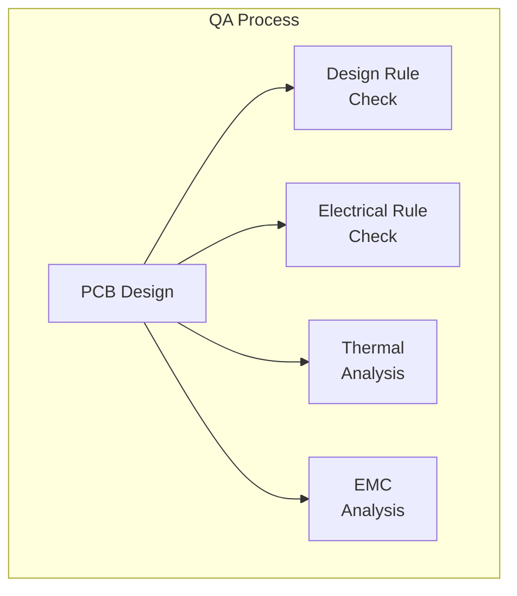

## Data Flow

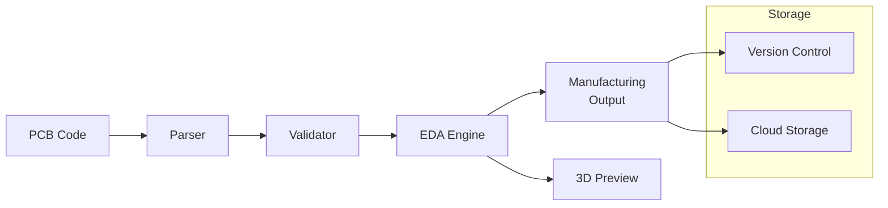

## Security Model

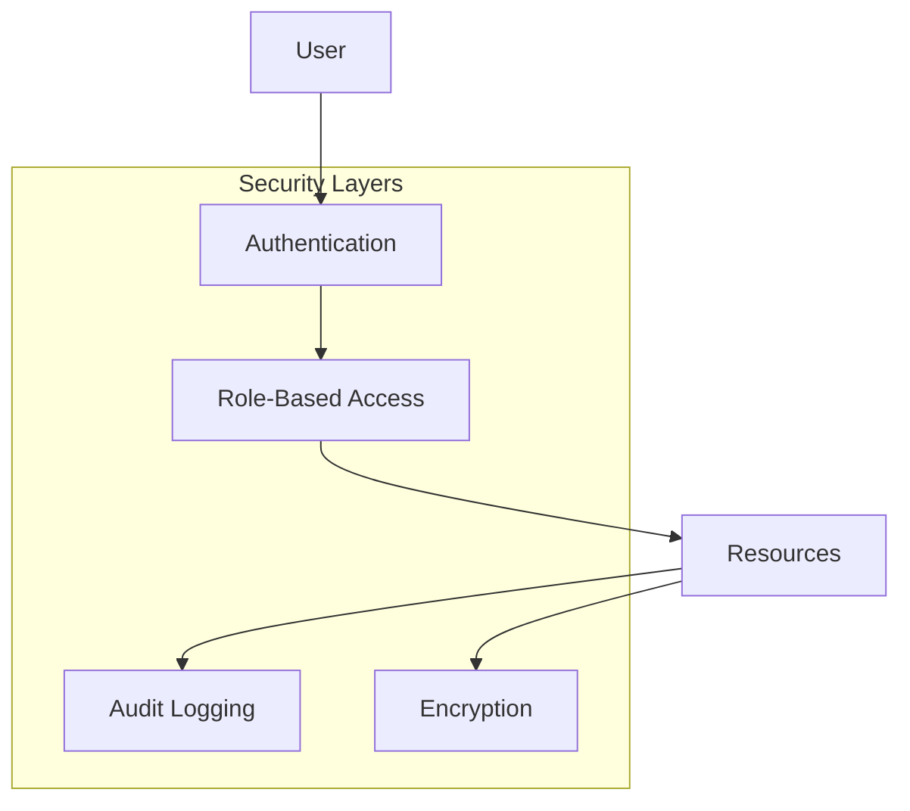

## Deployment Architecture

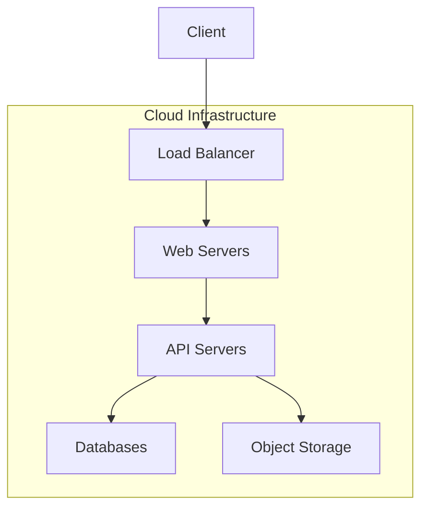

## PCB Layout Automation

### 1. Layout Engine Core
- AI-driven component placement based on historical data
- Multi-stage routing optimization
- Real-time DRC checking
- EMI/EMC analysis and optimization
- Thermal analysis and management

### 2. Board-Specific Layout Considerations

#### Energy Recovery Board (Highest Complexity)
- High current paths optimization
- EMI shielding for AC-DC conversion
- Thermal management for power components
- Isolation between power and control circuits
- Critical component placement:
  - Power MOSFETs
  - Filter capacitors
  - Current sensing
  - Gate drivers

#### Battery Management Board
- High current charging paths
- Cell balancing circuit layout
- Temperature sensor placement
- Protection circuit placement
- Isolation considerations:
  - Control/power separation
  - Sensing circuit isolation
  - Communication circuit isolation

#### Motor Control Board
- FOC driver layout optimization
- Power stage component placement
- Hall sensor signal routing
- High-speed signal considerations:
  - Differential pair routing
  - Length matching
  - Impedance control

#### Main Control Board
- User interface component placement
- Power management circuit layout
- Communication interface routing
- General considerations:
  - Ground plane design
  - Power plane segmentation
  - Signal integrity

### 3. Layout Automation Workflow

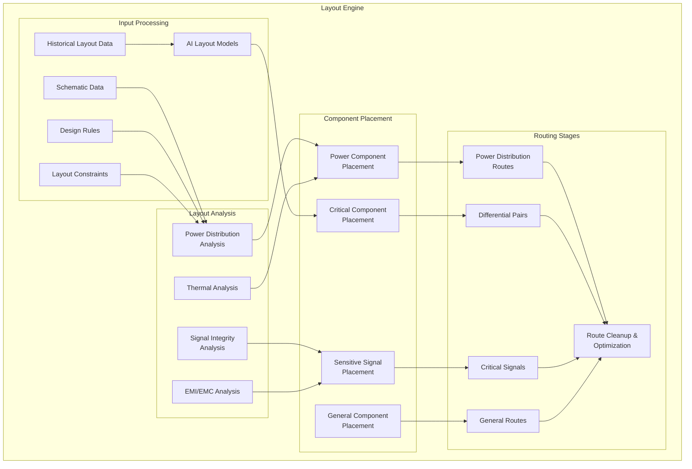

### 4. E-Bike System Layout

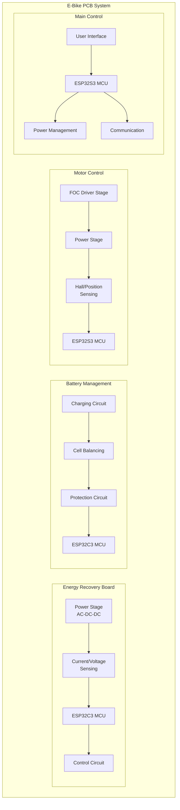

### 5. Layout Priority Rules

```mermaid
graph TB
    subgraph "Layout Priority Workflow"
        Start["Start Layout"]
        
        subgraph "Power Distribution (80%)"
            Power["Power Planning"]
            Ground["Ground Planning"]
            Current["Current Path<br/>Optimization"]
            Thermal["Thermal Management"]
        end
        
        subgraph "Signal Integrity (15%)"
            HighSpeed["High-Speed Signals"]
            Diff["Differential Pairs"]
            Length["Length Matching"]
            EMI["EMI Protection"]
        end
        
        subgraph "General Routing (5%)"
            Control["Control Signals"]
            Support["Support Components"]
            Mechanical["Mechanical<br/>Considerations"]
        end
        
        DRC["Design Rule Check"]
        End["Layout Complete"]
    end
    
    Start --> Power
    Power --> Ground
    Ground --> Current
    Current --> Thermal
    
    Thermal --> HighSpeed
    HighSpeed --> Diff
    Diff --> Length
    Length --> EMI
    
    EMI --> Control
    Control --> Support
    Support --> Mechanical
    
    Mechanical --> DRC
    DRC --> End
```

1. Power Distribution (80% of layout time)
   - High current paths
   - Power plane design
   - Ground plane optimization
   - Thermal considerations

2. Signal Integrity (15% of layout time)
   - Critical signal routing
   - Differential pairs
   - Length matching
   - EMI/EMC considerations

3. General Routing (5% of layout time)
   - Non-critical signals
   - Support components
   - Mechanical considerations

### 6. AI-Assisted Layout Features

- Learning from existing successful layouts
- Component placement optimization
- Route pattern recognition
- Design rule validation
- Thermal pattern analysis
- EMI hotspot prediction

### 7. Manufacturing Considerations

- Layer stackup optimization
- Impedance control
- Via placement and types
- Copper balance
- Thermal relief
- Test point accessibility

This expanded architecture provides a comprehensive view of the system's capabilities and interactions. Each component is designed to be modular and scalable, allowing for future enhancements and optimizations.
